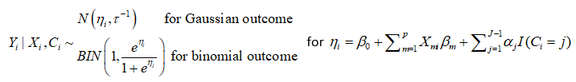
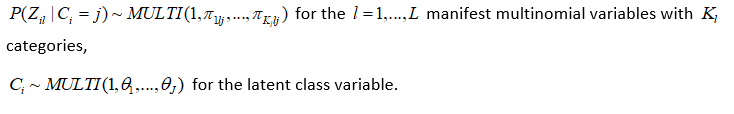
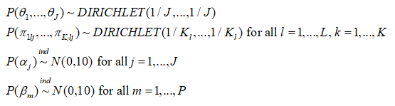
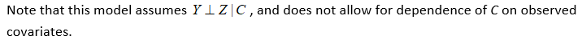

<!-- README.md is generated from README.Rmd. Please edit that file -->

# R package `lcra`

[](https://doi.org/10.1097/EDE.0000000000001139)
[](https://github.com/umich-biostatistics/lcra)
[](https://github.com/umich-biostatistics/lcra)

A user-friendly interface for doing joint Bayesian latent class and
regression analysis with binary and continuous outcomes.

Simply specify the regression model and number of classes and lcra
predicts class membership for each observation and accounts for
uncertainty in class membership in the estimation of the regression
parameters.

## Why use this package?

This is the only package available for joint latent class and regression
analysis. Other packages use a sequential procedure, where latent
classes are determined prior to fitting the usual regression model. The
only Bayesian alternative will require you to program the model by hand,
which can be time consuming.

## Overview

This `R` package provides a user-friendly interface for fitting Bayesian
joint latent class and regression models. Using the standard R syntax,
the user can specify the form of the regression model and the desired
number of latent classes.

The technical details of the model implemented here are described in
Elliott, Michael R., Zhao, Zhangchen, Mukherjee, Bhramar, Kanaya, Alka,
Needham, Belinda L., “Methods to account for uncertainty in latent class
assignments when using latent classes as predictors in regression
models, with application to acculturation strategy measures” (2020) In
press at Epidemiology. <doi:10.1097/EDE.0000000000001139>

## Installation

This package uses the R interface for WinBUGS called `R2WinBUGS`. The
package `R2WinBUGS` in turn depends on the standalone Windows program
`WinBUGS`. Follow this link: [University of Cambridge MRC Biostatistics
Unit](https://www.mrc-bsu.cam.ac.uk/software/bugs/the-bugs-project-winbugs/)
for WinBUGS download and installation instructions. `WinBUGS` can also
be used on Mac using the additional software
[Wine](https://www.winehq.org/). Plenty of tutorials that demonstrate
install of WinBUGS on non-Windows machines are available on Google. With
a bit of work, unix users can run this software, too.

Once the standalone `WinBUGS` program is installed, open R and run:

If the devtools package is not yet installed, install it first:

``` r
install.packages('devtools')
library(devtools)
```

``` r
# install lcra from Github:
install_github('umich-biostatistics/lcra') 
library(lcra)
```

## Example usage

### Quick example:

``` r
inits = list(list(theta = c(0.33, 0.33, 0.34), beta = rep(0, length = 3), 
                  alpha = rep(0, length = 2), tau = 0.5, true = rep(1, length = nrow(express))))
         
fit = lcra(formula = y ~ x1 + x2, family = "gaussian", data = express,
           nclasses = 3, inits = inits, manifest = paste0("Z", 1:5),
           n.chains = 1, n.iter = 500)

fit$mean$alpha
fit$mean$beta
fit$median$true

print(fit)
plot(fit)
```

NOTE: WinBUGS throws an error on Windows machines if you are not running
as administrator. The error reads: Error in file(con, “wb”) : cannot
open the connection.

Ignore the error. Once WinBUGS is finished drawing samples, follow the
promp and return to R.

### Model

The LCRA model is as follows: 


The following priors are the default and cannot be altered by the user:

 

Please note also that the reference category for latent classes in the
outcome model output is always the th latent class in the output, and
the bugs output is defined by the Latin equivalent of the model
parameters (beta, alpha, tau, pi, theta). Also, the bugs output includes
the variable true, which corresponds to the MCMC draws of , as well as
the MCMC draws of the deviance (DIC) statistic. Finally the bugs output
for pi is stored in a three dimensional array corresponding to (class,
variable, category), where category is indexed by 1 through ; for
variables where the number of categories is less than , these cells will
be set to NA. The parameters outputted by the lcra function currently
are not user definable.

### More examples:

The main function for the joint model is `lcra()`. Use `?lcra` for the R
help file.

Here is an example analysis on simulated data with continuous and
discrete outcomes:

``` r
# Data sets 1 and 2
data('paper_sim')
data('paper_sim_binary')

# Set initial values
inits =
  list(
    list(
      theta = c(0.33, 0.33, 0.34),
      beta = rep(0, length = 3),
      alpha = rep(0, length = 2),
      tau = 0.5,
      true = rep(1, length = 100)
    ),
    list(
      theta = c(0.33, 0.33, 0.34),
      beta = rep(0, length = 3),
      alpha = rep(0, length = 2),
      tau = 0.5,
      true = rep(1, length = 100)
    ),
    list(
      theta = c(0.33, 0.33, 0.34),
      beta = rep(0, length = 3),
      alpha = rep(0, length = 2),
      tau = 0.5,
      true = rep(1, length = 100)
    )
  )

inits_binary =
  list(
    list(
      theta = c(0.33, 0.33, 0.34),
      beta = rep(0, length = 3),
      alpha = rep(0, length = 2),
      true = rep(1, length = 100)
    ),
    list(
      theta = c(0.33, 0.33, 0.34),
      beta = rep(0, length = 3),
      alpha = rep(0, length = 2),
      true = rep(1, length = 100)
    ),
    list(
      theta = c(0.33, 0.33, 0.34),
      beta = rep(0, length = 3),
      alpha = rep(0, length = 2),
      true = rep(1, length = 100)
    )
  )

# Fit model 1
fit.gaus_paper =
  lcra(
    formula = Y ~ X1 + X2,
    family = "gaussian",
    data = paper_sim,
    nclasses = 3,
    manifest = paste0("Z", 1:10),
    inits = inits,
    dir = tempdir(),
    n.chains = 3,
    n.iter = 5000
  )

# Model 1 results
print(fit.gaus_paper, digits = 3)
plot(fit.gaus_paper)

# Extract results
fit.gaus_paper$median$true
fit.gaus_paper$median$beta
fit.gaus_paper$median$alpha

# Fit model 2
fit.binom_paper = 
  lcra(
    formula = Y ~ X1 + X2,
    family = "binomial",
    data = paper_sim_binary,
    nclasses = 3,
    manifest = paste0("Z", 1:10),
    inits = inits_binary,
    dir = tempdir(),
    n.chains = 3,
    n.iter = 5000
  )

# Model 2 results
print(fit.binom_paper, digits = 3)
plot(fit.binom_paper)

# Extract results
fit.binom_paper$median$true
fit.binom_paper$median$beta
fit.binom_paper$median$alpha


# simulated examples

library(gtools) # for Dirichel distribution

# with binary response 

n <- 500

X1 <- runif(n, 2, 8)
X2 <- rbinom(n, 1, .5)
Cstar <- rnorm(n, .25 * X1 - .75 * X2, 1)
C <- 1 * (Cstar <= .8) + 2 * ((Cstar > .8) & (Cstar <= 1.6)) + 3 * (Cstar > 1.6)

theta1 <- rdirichlet(10, c(5, 4, 3, 2, 1))
theta2 <- rdirichlet(10, c(1, 3, 5, 3, 1))
theta3 <- rdirichlet(10, c(1, 2, 3, 4, 5))

Z1<-(C==1)*t(rmultinom(n,1,theta1[1,]))%*%c(1:5)+(C==2)*t(rmultinom(n,1,theta2[1,]))%*%c(1:5)+(C==3)*t(rmultinom(n,1,theta3[1,]))%*%c(1:5)
Z2<-(C==1)*t(rmultinom(n,1,theta1[2,]))%*%c(1:5)+(C==2)*t(rmultinom(n,1,theta2[2,]))%*%c(1:5)+(C==3)*t(rmultinom(n,1,theta3[2,]))%*%c(1:5)
Z3<-(C==1)*t(rmultinom(n,1,theta1[3,]))%*%c(1:5)+(C==2)*t(rmultinom(n,1,theta2[3,]))%*%c(1:5)+(C==3)*t(rmultinom(n,1,theta3[3,]))%*%c(1:5)
Z4<-(C==1)*t(rmultinom(n,1,theta1[4,]))%*%c(1:5)+(C==2)*t(rmultinom(n,1,theta2[4,]))%*%c(1:5)+(C==3)*t(rmultinom(n,1,theta3[4,]))%*%c(1:5)
Z5<-(C==1)*t(rmultinom(n,1,theta1[5,]))%*%c(1:5)+(C==2)*t(rmultinom(n,1,theta2[5,]))%*%c(1:5)+(C==3)*t(rmultinom(n,1,theta3[5,]))%*%c(1:5)
Z6<-(C==1)*t(rmultinom(n,1,theta1[6,]))%*%c(1:5)+(C==2)*t(rmultinom(n,1,theta2[6,]))%*%c(1:5)+(C==3)*t(rmultinom(n,1,theta3[6,]))%*%c(1:5)
Z7<-(C==1)*t(rmultinom(n,1,theta1[7,]))%*%c(1:5)+(C==2)*t(rmultinom(n,1,theta2[7,]))%*%c(1:5)+(C==3)*t(rmultinom(n,1,theta3[7,]))%*%c(1:5)
Z8<-(C==1)*t(rmultinom(n,1,theta1[8,]))%*%c(1:5)+(C==2)*t(rmultinom(n,1,theta2[8,]))%*%c(1:5)+(C==3)*t(rmultinom(n,1,theta3[8,]))%*%c(1:5)
Z9<-(C==1)*t(rmultinom(n,1,theta1[9,]))%*%c(1:5)+(C==2)*t(rmultinom(n,1,theta2[9,]))%*%c(1:5)+(C==3)*t(rmultinom(n,1,theta3[9,]))%*%c(1:5)
Z10<-(C==1)*t(rmultinom(n,1,theta1[10,]))%*%c(1:5)+(C==2)*t(rmultinom(n,1,theta2[10,]))%*%c(1:5)+(C==3)*t(rmultinom(n,1,theta3[10,]))%*%c(1:5)

Z <- cbind(Z1, Z2, Z3, Z4, Z5, Z6, Z7, Z8, Z9, Z10)

Y <- rbinom(n, 1, exp(-1 - .1*X1 + X2 + 2*(C == 1) + 1*(C == 2)) / (1 + exp(1 - .1*X1 + X2 + 2*(C == 1) + 1*(C == 2))))

mydata = data.frame(Y, X1, X2, Z1, Z2, Z3, Z4, Z5, Z6, Z7, Z8, Z9, Z10)

inits = list(list(theta = c(0.33, 0.33, 0.34), beta = rep(0, length = 3),
                  alpha = rep(0, length = 2), true = rep(1, length = nrow(mydata))))

fit = lcra(formula = Y ~ X1 + X2, family = "binomial", data = mydata,
           nclasses = 3, inits = inits, manifest = paste0("Z", 1:10),
           n.chains = 1, n.iter = 1000)

print(fit)
plot(fit)

# with continuous response

n <- 500

X1 <- runif(n, 2, 8)
X2 <- rbinom(n, 1, .5)
Cstar <- rnorm(n, .25*X1 - .75*X2, 1)
C <- 1 * (Cstar <= .8) + 2*((Cstar > .8) & (Cstar <= 1.6)) + 3*(Cstar > 1.6)

theta1 <- rdirichlet(10, c(5, 4, 3, 2, 1))
theta2 <- rdirichlet(10, c(1, 3, 5, 3, 1))
theta3 <- rdirichlet(10, c(1, 2, 3, 4, 5))
theta4 <- rdirichlet(10, c(1, 1, 1, 1, 1))

Z1<-(C==1)*t(rmultinom(n,1,theta1[1,]))%*%c(1:5)+(C==2)*t(rmultinom(n,1,theta2[1,]))%*%c(1:5)+(C==3)*t(rmultinom(n,1,theta3[1,]))%*%c(1:5)+(C==4)*t(rmultinom(n,1,theta4[1,]))%*%c(1:5)
Z2<-(C==1)*t(rmultinom(n,1,theta1[2,]))%*%c(1:5)+(C==2)*t(rmultinom(n,1,theta2[2,]))%*%c(1:5)+(C==3)*t(rmultinom(n,1,theta3[2,]))%*%c(1:5)+(C==4)*t(rmultinom(n,1,theta4[2,]))%*%c(1:5)
Z3<-(C==1)*t(rmultinom(n,1,theta1[3,]))%*%c(1:5)+(C==2)*t(rmultinom(n,1,theta2[3,]))%*%c(1:5)+(C==3)*t(rmultinom(n,1,theta3[3,]))%*%c(1:5)+(C==4)*t(rmultinom(n,1,theta4[3,]))%*%c(1:5)
Z4<-(C==1)*t(rmultinom(n,1,theta1[4,]))%*%c(1:5)+(C==2)*t(rmultinom(n,1,theta2[4,]))%*%c(1:5)+(C==3)*t(rmultinom(n,1,theta3[4,]))%*%c(1:5)+(C==4)*t(rmultinom(n,1,theta4[4,]))%*%c(1:5)
Z5<-(C==1)*t(rmultinom(n,1,theta1[5,]))%*%c(1:5)+(C==2)*t(rmultinom(n,1,theta2[5,]))%*%c(1:5)+(C==3)*t(rmultinom(n,1,theta3[5,]))%*%c(1:5)+(C==4)*t(rmultinom(n,1,theta4[5,]))%*%c(1:5)
Z6<-(C==1)*t(rmultinom(n,1,theta1[6,]))%*%c(1:5)+(C==2)*t(rmultinom(n,1,theta2[6,]))%*%c(1:5)+(C==3)*t(rmultinom(n,1,theta3[6,]))%*%c(1:5)+(C==4)*t(rmultinom(n,1,theta4[6,]))%*%c(1:5)
Z7<-(C==1)*t(rmultinom(n,1,theta1[7,]))%*%c(1:5)+(C==2)*t(rmultinom(n,1,theta2[7,]))%*%c(1:5)+(C==3)*t(rmultinom(n,1,theta3[7,]))%*%c(1:5)+(C==4)*t(rmultinom(n,1,theta4[7,]))%*%c(1:5)
Z8<-(C==1)*t(rmultinom(n,1,theta1[8,]))%*%c(1:5)+(C==2)*t(rmultinom(n,1,theta2[8,]))%*%c(1:5)+(C==3)*t(rmultinom(n,1,theta3[8,]))%*%c(1:5)+(C==4)*t(rmultinom(n,1,theta4[8,]))%*%c(1:5)
Z9<-(C==1)*t(rmultinom(n,1,theta1[9,]))%*%c(1:5)+(C==2)*t(rmultinom(n,1,theta2[9,]))%*%c(1:5)+(C==3)*t(rmultinom(n,1,theta3[9,]))%*%c(1:5)+(C==4)*t(rmultinom(n,1,theta4[9,]))%*%c(1:5)
Z10<-(C==1)*t(rmultinom(n,1,theta1[10,]))%*%c(1:5)+(C==2)*t(rmultinom(n,1,theta2[10,]))%*%c(1:5)+(C==3)*t(rmultinom(n,1,theta3[10,]))%*%c(1:5)+(C==4)*t(rmultinom(n,1,theta4[10,]))%*%c(1:5)

Z <- cbind(Z1, Z2, Z3, Z4, Z5, Z6, Z7, Z8, Z9, Z10)

Y <- rnorm(n, 10 - .5*X1 + 2*X2 + 2*(C == 1) + 1*(C == 2), 1)

mydata = data.frame(Y, X1, X2, Z1, Z2, Z3, Z4, Z5, Z6, Z7, Z8, Z9, Z10)

inits = list(list(theta = c(0.33, 0.33, 0.34), beta = rep(0, length = 3),
                  alpha = rep(0, length = 2), true = rep(1, length = nrow(mydata)), 
                  tau = 0.5))

fit = lcra(formula = Y ~ X1 + X2, family = "gaussian", data = mydata,
           nclasses = 3, inits = inits, manifest = paste0("Z", 1:10),
           n.chains = 1, n.iter = 1000)

print(fit)
plot(fit)
```

For more examples, run `?lcra` at the console, and scroll to Examples in
the documentation file.

### Current Suggested Citation

“Methods to account for uncertainty in latent class assignments when
using latent classes as predictors in regression models, with
application to acculturation strategy measures” (2020) In press at
Epidemiology. <doi:10.1097/EDE.0000000000001139>
